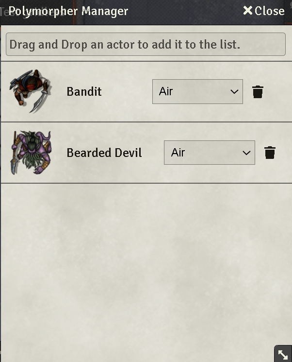
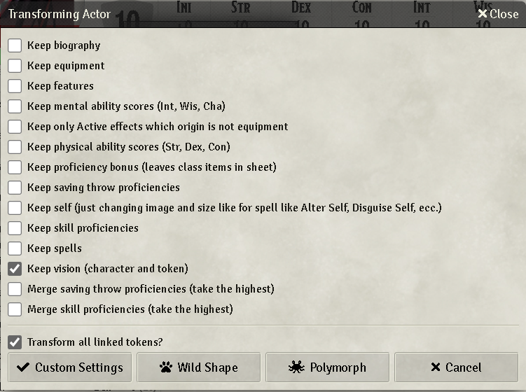

#  FoundryVTT Automated Polymorpher

 

[](https://forge-vtt.com/bazaar#package=automated-polymorpher)


[](https://www.foundryvtt-hub.com/package/automated-polymorpher/)

### If you want to buy me a coffee [](https://www.patreon.com/p4535992)

# THIS MODULE IS LOOKING FOR A NEW ACTIVE DEVELOPER

A user interface to manage the polymorph feature of Dnd5e with summoning animations.

**Note: This is module is inspired from the  wonderful work done by [theRipper93](https://github.com/theripper93) with its [automated-evocations](https://github.com/theripper93/automated-evocations) module.
If you want to support more modules of this kind, I invite you to go and support his patreon**

[](https://www.patreon.com/theripper93) [](https://discord.gg/F53gBjR97G)

Should work with all system supported from the [warpgate](https://github.com/trioderegion/warpgate) module "mutate" function, but for now the module is only used and tested with the Dnd5e system and the polymorph mechanism.


## NOTE this module work very well with this other module [Automated Evocations (Variant Fork)](https://github.com/p4535992/automated-evocations-variant)

## NOTE: If you are a javascript developer and not a typescript developer, you can just use the javascript files under the dist folder

## Known issue/Limitation

- Sadly i have to create a temprary actor for save the data of the polymorphed acotr (just like dnd5e do now), but everything is going by the plan you didn't notice because i automatically delete the actor when you revert the polymorphing, in the worst case scenario you can just go to delete the actor the standard way.
- Sadly i cannot understand a strange beahviour with warpgater after the mutation the mutated token is still linked to the original actor, i try everything, but it still show the original actor sheet. You can test the behaviour enabling the module settings 'Force use of Warpgate' Here a video of the problem:


## Installation

It's always easiest to install modules from the in game add-on browser.

To install this module manually:
1.  Inside the Foundry "Configuration and Setup" screen, click "Add-on Modules"
2.  Click "Install Module"
3.  In the "Manifest URL" field, paste the following url:
`https://raw.githubusercontent.com/p4535992/foundryvtt-automated-polymorpher/master/src/module.json`
4.  Click 'Install' and wait for installation to complete
5.  Don't forget to enable the module in game using the "Manage Module" button

### sequencer

This module uses the [sequencer](https://github.com/fantasycalendar/FoundryVTT-Sequencer/) library. It is a hard dependency.

### warpgate

This module uses the [warpgate](https://github.com/trioderegion/warpgate) library. It is a mandatory dependency and it is recommended for the best experience and compatibility with other modules.

### socketlib

This module uses the [socketlib](https://github.com/manuelVo/foundryvtt-socketlib) library for wrapping core methods. It is a hard dependency and it is recommended for the best experience and compatibility with other modules.
### advanced-macros (optional)

This module uses the [advanced-macros](https://github.com/League-of-Foundry-Developers/fvtt-advanced-macros) library. It is a optional dependency and it is recommended for the best experience and compatibility with other modules.

**NOTE: you need this only for the custom macro feature, i don't suggest it is much easier to create the actors and set them up, with the drag and drop but it's up to you**

## Features 

## Token configuration panel


Open any character sheet, in the header of the window you will see the polymorphers button


Upon opening you will be welcomed by a window, from here you can drag and drop actor into it to add them.

After adding actor to the window you will have some options:

- To mutate click on the actor image
- The dropdown will let you chose the summoning animation



Then you interact with the standard panel of the Polymorph (if the system is dnd5e)



## Store polymorphers on actor

By default polymorphers are stored per user (so each actor will have the same summon list). If you want a particular actor to have it's own summon list you can use the included macro to switch the actor from global storage to local (on the actor). Simply place a linked actor on the scene, select it and run the macro. Using the other macro to switch it to global again will not wipe the saved polymorphers so setting it to local at a later date will restore the previous list.

For more advanced users you can set the flag with the following command : `actor.setFlag('automated-polymorpher','storeonactor', false)` (set true\false to enable disable the store on actor)

## Token HUD fast click

An interface in the hud layer now allows you to speed up the transformations during a fight in a very intuitive way to manage the transformations there are three modes, at the level of the individual actor:

- Random: the next transformation is randomly taken from the list of transformations associated with the actor
- Ordered: the next transformation is taken according to the order of the list of transformations associated with the actor
- No random, No orderder: the standard method shows the configuration panel that you would have by clicking on the header sheet button

the actions on the hud button are of two types left click and right click. 

- Left click activates the transformation event
- Right click reverts the transformation and returns to the original shape.


**NOTE: you can't have both ordered and random**
**NOTE: Remember you must own the token for see the HUD button**

# API

###  async game.modules.get('automated-polymorpher').api.invokePolymorpherManager(sourceTokenIdOrName: string, removePolymorpher = false, ordered = false, random = false, animationExternal:{ sequence:Sequence, timeToWait:number }|undefined = undefined) ⇒ <code>Promise.&lt;void&gt;</code>

Invoke the polymorpher manager feature from macro

**Returns**: <code>Promise.&lt;void&gt;</code> - A empty promise

| Param | Type | Description | Default |
| --- | --- | --- | --- |
| sourceTokenIdOrName | <code>string</code> | The id or the name of the token (not the actor) | <code>undefined</code> |
| removePolymorpher | <code>boolean</code> | This action should revert the polymorpher if the current token is polymorphed | <code>false</code> |
| ordered | <code>boolean</code> | The 'ordered' feature is enabled for this polymorphing | <code>false</code> |
| random | <code>boolean</code> | The 'random' feature is enabled for this polymorphing | <code>0</code> |
| animationExternal | <code>{ sequence:Sequence, timeToWait:number }</code> | Advanced: Use your personal sequence animation and the time needed to wait before the polymorph action, checkout the [Sequencer module](https://github.com/fantasycalendar/FoundryVTT-Sequencer) for more information  | <code>undefined</code> |

**NOTE:** If both 'random' and 'ordered' are false the standard dialog will be rendered.

**Examples**:

`game.modules.get('automated-polymorpher').api.invokePolymorpherManager('Zruggig Widebrain')`

`game.modules.get('automated-polymorpher').api.invokePolymorpherManager('Zruggig Widebrain', true)`

`game.modules.get('automated-polymorpher').api.invokePolymorpherManager('Zruggig Widebrain', false, false)`

`game.modules.get('automated-polymorpher').api.invokePolymorpherManager('Zruggig Widebrain', false, false, false)`

```
let sequence = new Sequence()
    .effect()
        .file("modules/animated-spell-effects-cartoon/spell-effects/cartoon/electricity/electrivity_blast_CIRCLE.webm")
        .atLocation(tokenD)
        .scale(0.35)
    .wait(1000)
        .effect()
        .file("modules/animated-spell-effects-cartoon/spell-effects/cartoon/electricity/lightning_bolt_RECTANGLE_05.webm")
        .atLocation(tokenD)
        .reachTowards({
            x: tokenD.center.x + canvas.grid.size*5,
            y: tokenD.center.y
        })
    .wait(100)
    .animation()
        .on(tokenD)
        .teleportTo({
            x: tokenD.x + canvas.grid.size*5,
            y: tokenD.y
        })
        .waitUntilFinished()
    .effect()
        .file("modules/animated-spell-effects-cartoon/spell-effects/cartoon/electricity/electric_ball_CIRCLE_06.webm")
        .atLocation(tokenD)
        .scale(0.5)

game.modules.get('automated-polymorpher').api.invokePolymorpherManager('Zruggig Widebrain', false, false, false, { sequence: sequence, timeToWait 1100})
```

###  async game.modules.get('automated-polymorpher').api.invokePolymorpherManagerFromActor(sourceActorIdOrName: string, removePolymorpher = false, ordered = false, random = false, animationExternal:{ sequence:Sequence, timeToWait:number }|undefined = undefined) ⇒ <code>Promise.&lt;void&gt;</code>

Invoke the polymorpher manager feature from macro

**Returns**: <code>Promise.&lt;void&gt;</code> - A empty promise

| Param | Type | Description | Default |
| --- | --- | --- | --- |
| sourceActorIdOrName | <code>string</code> | The id or the name of the actor (not the token) | <code>undefined</code> |
| removePolymorpher | <code>boolean</code> | This action should revert the polymorpher if the current token is polymorphed | <code>false</code> |
| ordered | <code>boolean</code> | The 'ordered' feature is enabled for this polymorphing | <code>false</code> |
| random | <code>boolean</code> | The 'random' feature is enabled for this polymorphing | <code>0</code> |
| animationExternal | <code>{ sequence:Sequence, timeToWait:number }</code> | Advanced: Use your personal sequence animation and the time needed to wait before the polymorph action, checkout the [Sequencer module](https://github.com/fantasycalendar/FoundryVTT-Sequencer) for more information  | <code>undefined</code> |

**NOTE:** If both 'random' and 'ordered' are false the standard dialog will be rendered.

**Examples**:

`game.modules.get('automated-polymorpher').api.invokePolymorpherManagerFromActor('Zruggig Widebrain')`

`game.modules.get('automated-polymorpher').api.invokePolymorpherManagerFromActor('Zruggig Widebrain', true)`

`game.modules.get('automated-polymorpher').api.invokePolymorpherManagerFromActor('Zruggig Widebrain', false, false)`

`game.modules.get('automated-polymorpher').api.invokePolymorpherManagerFromActor('Zruggig Widebrain', false, false, false)`

```
let sequence = new Sequence()
    .effect()
        .file("modules/animated-spell-effects-cartoon/spell-effects/cartoon/electricity/electrivity_blast_CIRCLE.webm")
        .atLocation(tokenD)
        .scale(0.35)
    .wait(1000)
        .effect()
        .file("modules/animated-spell-effects-cartoon/spell-effects/cartoon/electricity/lightning_bolt_RECTANGLE_05.webm")
        .atLocation(tokenD)
        .reachTowards({
            x: tokenD.center.x + canvas.grid.size*5,
            y: tokenD.center.y
        })
    .wait(100)
    .animation()
        .on(tokenD)
        .teleportTo({
            x: tokenD.x + canvas.grid.size*5,
            y: tokenD.y
        })
        .waitUntilFinished()
    .effect()
        .file("modules/animated-spell-effects-cartoon/spell-effects/cartoon/electricity/electric_ball_CIRCLE_06.webm")
        .atLocation(tokenD)
        .scale(0.5)

game.modules.get('automated-polymorpher').api.invokePolymorpherManagerFromActor('Zruggig Widebrain', false, false, false, { sequence: sequence, timeToWait 1100})
```

### Macro to clean up flags on token and actor

####  async game.modules.get('automated-polymorpher').api.cleanUpTokenSelected() ⇒ <code>Promise.&lt;void&gt;</code>

**Examples**:

`game.modules.get('automated-polymorpher').api.cleanUpTokenSelected()`

## Integration with socketLib


```
let sequence = new Sequence()
    .effect()
        .file("modules/animated-spell-effects-cartoon/spell-effects/cartoon/electricity/electrivity_blast_CIRCLE.webm")
        .atLocation(tokenD)
        .scale(0.35)
    .wait(1000)
        .effect()
        .file("modules/animated-spell-effects-cartoon/spell-effects/cartoon/electricity/lightning_bolt_RECTANGLE_05.webm")
        .atLocation(tokenD)
        .reachTowards({
            x: tokenD.center.x + canvas.grid.size*5,
            y: tokenD.center.y
        })
    .wait(100)
    .animation()
        .on(tokenD)
        .teleportTo({
            x: tokenD.x + canvas.grid.size*5,
            y: tokenD.y
        })
        .waitUntilFinished()
    .effect()
        .file("modules/animated-spell-effects-cartoon/spell-effects/cartoon/electricity/electric_ball_CIRCLE_06.webm")
        .atLocation(tokenD)
        .scale(0.5)

game.modules.get('automated-polymorpher').socket.executeAsGM('invokePolymorpherManager',['Zruggig Widebrain', false, false, false, { sequence: sequence, timeToWait 1100}]);
```

# Build

## Install all packages

```bash
npm install
```
## npm build scripts

### build

will build the code and copy all necessary assets into the dist folder and make a symlink to install the result into your foundry data; create a
`foundryconfig.json` file with your Foundry Data path.

```json
{
  "dataPath": "~/.local/share/FoundryVTT/"
}
```

`build` will build and set up a symlink between `dist` and your `dataPath`.

```bash
npm run-script build
```

### NOTE:

You don't need to build the `foundryconfig.json` file you can just copy the content of the `dist` folder on the module folder under `modules` of Foundry

### build:watch

`build:watch` will build and watch for changes, rebuilding automatically.

```bash
npm run-script build:watch
```

### clean

`clean` will remove all contents in the dist folder (but keeps the link from build:install).

```bash
npm run-script clean
```
### lint and lintfix

`lint` launch the eslint process based on the configuration [here](./.eslintrc)

```bash
npm run-script lint
```

`lintfix` launch the eslint process with the fix argument

```bash
npm run-script lintfix
```

### prettier-format

`prettier-format` launch the prettier plugin based on the configuration [here](./.prettierrc)

```bash
npm run-script prettier-format
```

### package

`package` generates a zip file containing the contents of the dist folder generated previously with the `build` command. Useful for those who want to manually load the module or want to create their own release

```bash
npm run-script package
```

## [Changelog](./changelog.md)

## Issues

Any issues, bugs, or feature requests are always welcome to be reported directly to the [Issue Tracker](https://github.com/p4535992/foundryvtt-automated-polymorpher/issues ), or using the [Bug Reporter Module](https://foundryvtt.com/packages/bug-reporter/).

## License

- **Jack Kerouac's**: [GPL-3.0 License](https://github.com/jackkerouac/animated-tokens/blob/main/LICENSE)

- **JB2A**: [CC BY-NC-SA 4.0](https://github.com/Jules-Bens-Aa/JB2A_DnD5e/blob/main/License.txt)

- **Sequencer**: [Mit License](https://github.com/fantasycalendar/FoundryVTT-Sequencer/blob/master/LICENSE)

- **Warpgate**: [GPL-3.0 License](https://github.com/trioderegion/warpgate/blob/master/LICENSE)

- **Automated Evocations**: ???

- **Game Icons**: [CC BY 3.0](https://creativecommons.org/licenses/by/3.0/)

This package is under an [GPL-3.0 License](LICENSE) and the [Foundry Virtual Tabletop Limited License Agreement for module development](https://foundryvtt.com/article/license/).

## Credits

- **Jack Kerouac's**: The Fire, Air, Lightning, Water, Energy, Magic, Heart, Crescendo, Four Elements animations assets are from Jack Kerouac's amazing https://github.com/jackkerouac/animated-spell-effects-cartoon module. (used with permission)

- **JB2A**: The  Chord, Darkness, Ice, Conjuration, Storm animations assets are courtesy of JB2A (Free animated assets), i strongly reccomend checking out their patreon for many more amazing animations and variations. (used with permission) https://discord.gg/A59GAZwB9M https://www.patreon.com/JB2A

- **Sequencer**: This module is used to play the animations https://github.com/fantasycalendar/FoundryVTT-Sequencer

- **Warpgate**: This module is used for the spawning https://github.com/trioderegion/warpgate

- **Automated Evocations**: This module is used for the inspiration and base functionality https://github.com/theripper93/automated-evocations

- **Game Icons**: Some images used are from https://game-icons.net/

## Acknowledgements

Bootstrapped with League of Extraordinary FoundryVTT Developers  [foundry-vtt-types](https://github.com/League-of-Foundry-Developers/foundry-vtt-types).

Mad props to the 'League of Extraordinary FoundryVTT Developers' community which helped me figure out a lot.
